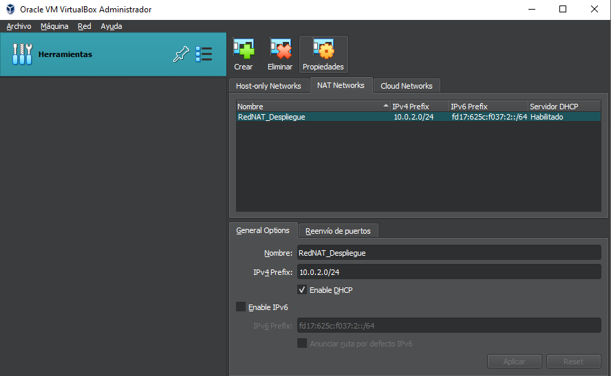
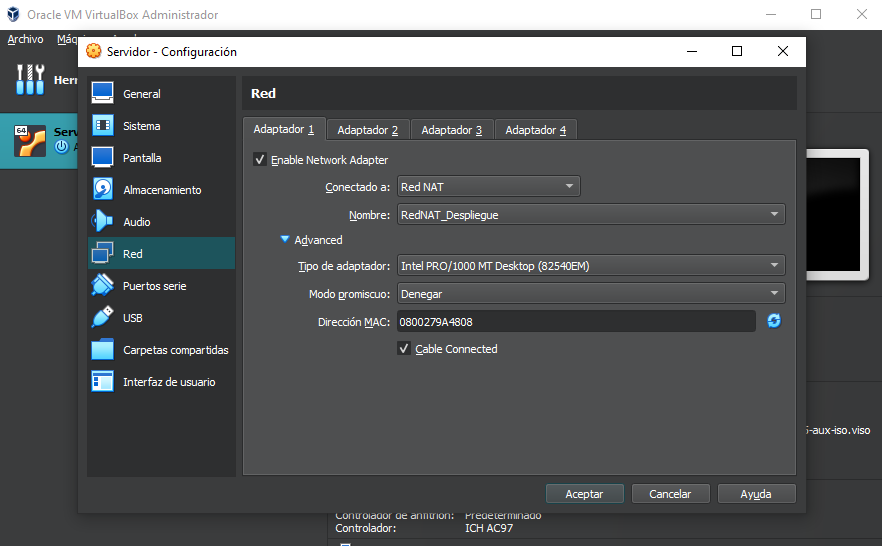
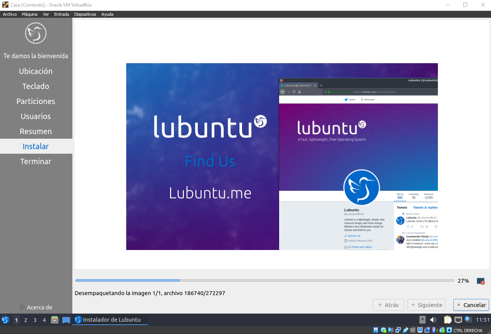

# Tarea 01 · Despliegue de Aplicaciones Web
___
## Oliver Fabian Stetcu Stepanov
___
### Tarea SSH - SCP - Shell - VirtualBox
___
>**Crea un repositorio PRIVADO en Github con la documentación de esta práctica. Redacta la práctica
usando Markdown, aporta trozos de código con los comandos ``shell`` y capturas de pantalla.**
# VirtualBox
___
Crea una **red NAT** con dos máquinas virtuales (MV):
* **Servidor**: con un Ubuntu server sin entorno gráfico.
    * Usuario: ``sergio``, contraseña: ``sergio``.
* **Casa**: con un Lubuntu con el entorno gráfico por defecto (LXQt).
    * Usuario: ``carmen``, contraseña: ``carmen``.

Ambas MV deben ser accesibles mediante ``ssh`` desde el **equipo anfitrión**.
Muestra el redireccionamiento de puertos (port forward).

Primero vamos a descargar la .iso de **Ubuntu Server** y **Lubuntu:**


Nos vamos al **VirtualBox** y creamos **la red Nat**:
(Herramientas > Menú Desplegable > Red > NAT Networks):



Click derecho y **"Crear"**, la vamos a llamar ``RedNAT_Despliegue``, ``IPv4 10.0.2.0/24`` y ``habilitamos el DHCP``.

Ahora vamos a crear las 2 máquinas virtuales (MV), tanto **Servidor** como **Casa**:
Le damos a **"Nueva"**, de nombre **"Servidor"**, seleccionamos la **.iso** descargada anteriormente **(Ubuntu Server)**, y le damos a **"Next"**.
Le asignamos el nombre y la contraseña que nos nos pide en la actividad **("sergio" en las dos)**.


Le damos a **"Next"**, asignamos **2GB de RAM**, asignamos **10GB de memoria**. Creamos el Servidor.

Hacemos click derecho a la MV y vamos a **"Red"**, le asignamos **"Red NAT"** y seleccionamos la **Red NAT** que hemos creado anteriormente.



Iniciamos la **MV del Servidor**. Seleccionamos el idioma a **español**, le damos a **"Continuar sin actualizar"**, teclado en idioma **español** y seleccionamos **"Ubuntu Server"** que viene por defecto. Ahora nos aparecerá la IP que tendrá nuestro servidor **"10.0.2.8/24"** (me asigna el 8) y podemos observar el nombre **"enp0s3"**.


Saltamos el **proxy** y va a realizar test para comprobar si hay errores. Le damos a **"Hecho"** hasta que nos pida insertar los datos de nuestro **perfil** y **servidor**. Le insertamos **"sergio"** en todos los campos. Y le damos a **"Hecho"** hasta que se inicie el Servidor.


Iniciamos sesión con el nombre y contraseña del Servidor, **"sergio"** en ambas.


Ya tendríamos iniciado nuestro Servidor. Ahora ejecutamos los siguientes comandos:

Comprobamos que se ha asignado la IP correctamente a nuestro Servidor:
```bash
ip a
```
Resultado:


Ejecutamos los siguientes comandos para instalar nuestro servidor Apache:

```bash
sudo apt update
sudo apt install apache2
sudo ufw app list
sudo ufw allow Apache
```

Y para el SSH:

```bash
sudo apt install openssh-server
systemctl status ssh
```

Comprobamos que tenemos Apache instalado y SSH:


Ahora cerramos nuestro servidor y vamos al VirtualBox. Vamos a Herramientas > Menú Desplegable > Red > Reenvío de Puertos. Estamos en el mismo sitio donde hemos creado la Red NAT.
Aquí le damos a **"Crear"** y creamos el reenvío de puertos para Apache y SSH. Para ello insertamos los siguientes datos (nombre, protocolo, IP anfitrión, puerto anfitrión, IP invitado y puerto invitado):

En nombre le asignamos el nombre, protocolo es el mismo en los dos, el IP anfitrión sería el localhost de nuestro pc, el puerto anfitrión de Apache es 8080 (si tenemos otro servidor le asignamos el 8081 por ejemplo) y para el SSH el puerto es el 2200 (le asignamos 2208 para referenciar nuestra MV), la IP invitado es la IP que tiene nuestra MV y el puerto invitado Apache tiene el 80 y SSH tiene el 22.

Le damos a **"Aplicar"**.


Para comprobar que tenemos activo el Apache ejecutamos el comando siguiente (debe salir ``active``):

```bash
systemctl status apache2
```

Podemos comprobar que funciona ejecutando en el navegador de nuestro pc lo siguiente: http://127.0.0.1:8080/

Nos saldrá esto:


Comprobamos que es accesible mediante **SSH** desde el anfitrión. Para ello, vamos a nuestro equipo y abrimos **cmd** (en mi caso porque estoy en Windows). Aquí ponemos el siguiente comando:

```bash
ssh sergio@127.0.0.1 -p 2208
```

Podemos comprobar que es accesible mediante **SSH** desde el anfitrión:


Ahora vamos a instalar nuestro **Lubuntu**. Para ello, vamos al **VirtualBox** y le damos a **"Nueva"**, de nombre le ponemos **"Casa"**, seleccionamos la **.iso** de **Lubuntu** y le damos a **"Next"**, asignamos **2GB de RAM**, asignamos **10GB de memoria**. Ahora le asignamos a la MV resultante la **Red NAT** (debe ser la misma que tiene el **Servidor**), le asignamos **"RedNAT_Despliegue"**.

Lo ejecutamos, instalamos el sistema operativo. Le indicamos el lenguaje a **español**, borramos el **disco duro** con swap, insertamos todos los datos en los campos que nos piden con los requisitos de la actividad (**"carmen"** en todo):



Lo instalamos.


Ejecutamos el terminal y comprobamos que está correcto:


Comprobamos que podemos conectar con google.es mediante el siguiente comando:

```bash
wget google.es
```


Ahora lo cerramos y vamos al VirtualBox. Vamos a Herramientas > Menú Desplegable > Red > Reenvío de Puertos. Estamos en el mismo sitio donde hemos creado la Red NAT.
Aquí le damos a **"Crear"** y creamos el reenvío de puertos para Apache y SSH. Para ello insertamos los siguientes datos (nombre, protocolo, IP anfitrión, puerto anfitrión, IP invitado y puerto invitado):

En nombre le asignamos el nombre, protocolo es el mismo en los dos, el IP anfitrión sería el localhost de nuestro pc, el puerto anfitrión de Apache es 8081 (porque el puerto 8080 está asignado) y para el SSH el puerto es el 2200 (le asignamos 2209 para referenciar nuestra MV), la IP invitado es la IP que tiene nuestra MV y el puerto invitado Apache tiene el 80 y SSH tiene el 22.

Le damos a **"Aplicar"**.


Instalamos el **SSH** con:

```bash
sudo apt install openssh-server
systemctl status ssh
```


Comprobamos si es accesible con SSH desde el equipo anfitrión. Para ello, vamos a nuestro equipo y abrimos **cmd** (en mi caso porque estoy en Windows). Aquí ponemos el siguiente comando:

```bash
ssh carmen@10.0.2.9 -p 2209
```

Resultado:

