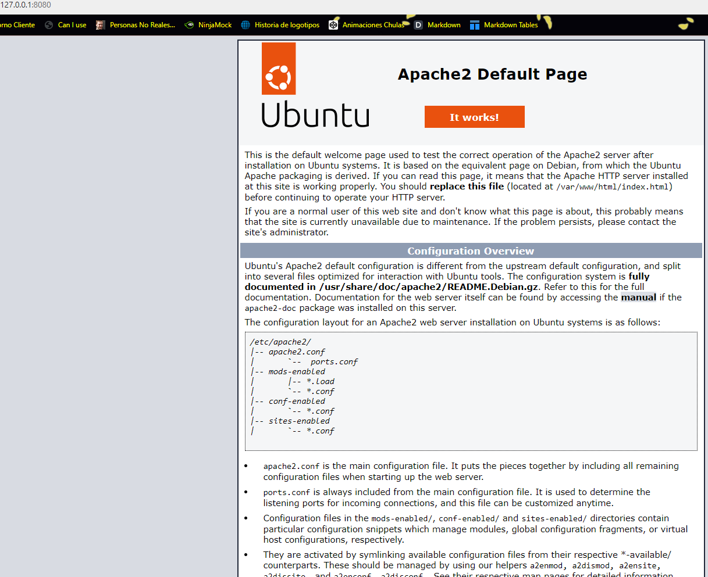
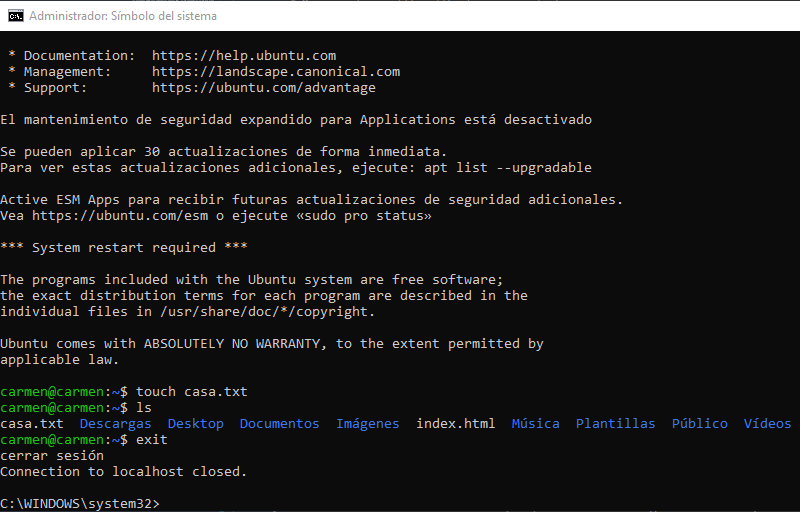

# Tarea 01 · Despliegue de Aplicaciones Web
___
## Oliver Fabian Stetcu Stepanov
___
### Tarea SSH - SCP - Shell - VirtualBox
___
>**Crea un repositorio PRIVADO en Github con la documentación de esta práctica. Redacta la práctica
usando Markdown, aporta trozos de código con los comandos ``shell`` y capturas de pantalla.**
# VirtualBox
___
Crea una **red NAT** con dos máquinas virtuales (MV):
* **Servidor**: con un Ubuntu server sin entorno gráfico.
    * Usuario: ``sergio``, contraseña: ``sergio``.
* **Casa**: con un Lubuntu con el entorno gráfico por defecto (LXQt).
    * Usuario: ``carmen``, contraseña: ``carmen``.

Ambas MV deben ser accesibles mediante ``ssh`` desde el **equipo anfitrión**.
Muestra el redireccionamiento de puertos (port forward).

Primero vamos a descargar la .iso de **Ubuntu Server** y **Lubuntu:**


Nos vamos al **VirtualBox** y creamos **la red Nat**:
(Herramientas > Menú Desplegable > Red > NAT Networks):


Click derecho y **"Crear"**, la vamos a llamar ``RedNAT_Despliegue``, ``IPv4 10.0.2.0/24`` y ``habilitamos el DHCP``.

Ahora vamos a crear las 2 máquinas virtuales (MV), tanto **Servidor** como **Casa**:
Le damos a **"Nueva"**, de nombre **"Servidor"**, seleccionamos la **.iso** descargada anteriormente **(Ubuntu Server)**, y le damos a **"Next"**.
Le asignamos el nombre y la contraseña que nos nos pide en la actividad **("sergio" en las dos)**.


Le damos a **"Next"**, asignamos **2GB de RAM**, asignamos **10GB de memoria**. Creamos el Servidor.

Hacemos click derecho a la MV y vamos a **"Red"**, le asignamos **"Red NAT"** y seleccionamos la **Red NAT** que hemos creado anteriormente.


Iniciamos la **MV del Servidor**. Seleccionamos el idioma a **español**, le damos a **"Continuar sin actualizar"**, teclado en idioma **español** y seleccionamos **"Ubuntu Server"** que viene por defecto. Ahora nos aparecerá la IP que tendrá nuestro servidor **"10.0.2.8/24"** (me asigna el 8) y podemos observar el nombre **"enp0s3"**.


Saltamos el **proxy** y va a realizar test para comprobar si hay errores. Le damos a **"Hecho"** hasta que nos pida insertar los datos de nuestro **perfil** y **servidor**. Le insertamos **"sergio"** en todos los campos. Y le damos a **"Hecho"** hasta que se inicie el Servidor.


Iniciamos sesión con el nombre y contraseña del Servidor, **"sergio"** en ambas.


Ya tendríamos iniciado nuestro Servidor. Ahora ejecutamos los siguientes comandos:

Comprobamos que se ha asignado la IP correctamente a nuestro Servidor:
```bash
ip a
```
Resultado:


Ahora cerramos nuestro servidor y vamos al VirtualBox. Vamos a Herramientas > Menú Desplegable > Red > Reenvío de Puertos. Estamos en el mismo sitio donde hemos creado la Red NAT.
Aquí le damos a **"Crear"** y creamos el reenvío de puertos para Apache y SSH. Para ello insertamos los siguientes datos (nombre, protocolo, IP anfitrión, puerto anfitrión, IP invitado y puerto invitado):

En nombre le asignamos el nombre, protocolo es el mismo en los dos, el IP anfitrión sería el localhost de nuestro pc, el puerto anfitrión de Apache es 8080 (si tenemos otro servidor le asignamos el 8081 por ejemplo) y para el SSH el puerto es el 2200 (le asignamos 2208 para referenciar nuestra MV), la IP invitado es la IP que tiene nuestra MV y el puerto invitado Apache tiene el 80 y SSH tiene el 22.

Le damos a **"Aplicar"**.


Para comprobar que tenemos activo el Apache ejecutamos el comando siguiente (debe salir ``active``):

```bash
systemctl status apache2
```

Podemos comprobar que funciona ejecutando en el navegador de nuestro pc lo siguiente: http://127.0.0.1:8080/

Nos saldrá esto:



Ahora vamos a instalar nuestro **Lubuntu**. Para ello, vamos al **VirtualBox** y le damos a **"Nueva"**, de nombre le ponemos **"Casa"**, seleccionamos la **.iso** de **Lubuntu** y le damos a **"Next"**, asignamos **2GB de RAM**, asignamos **10GB de memoria**. Ahora le asignamos a la MV resultante la **Red NAT** (debe ser la misma que tiene el **Servidor**), le asignamos **"RedNAT_Despliegue"**.


Lo ejecutamos, instalamos el sistema operativo. Le indicamos el lenguaje a **español**, borramos el **disco duro** con swap, insertamos todos los datos en los campos que nos piden con los requisitos de la actividad (**"carmen"** en todo):


Lo instalamos.


Ejecutamos el terminal y comprobamos que está correcto:


Comprobamos que podemos conectar con google.es mediante el siguiente comando:

```bash
wget google.es
```


Comprobamos que se ha asignado la IP correctamente a nuestra Casa:
```bash
ip a
```
Resultado:


# Linux Shell
___
Equipo **Servidor**:

Instala o comprueba que ya estén instalados los servicios: ``openssh-server`` y ``ufw``.

Comprueba que el servicio ``ufw`` está activo y en funcionamiento.

Comprueba que el servicio ``ssh`` está activo y en funcionamiento.

Añade la regla en el cortafuegos para ``ssh``.

>Recuerda usar systemctl.

Instalamos el **SSH** con:

```bash
sudo apt install openssh-server
systemctl status ssh
```


Comprobamos que tenemos Apache instalado y SSH (nos aparece la lista por lo tanto **ufw** está instalado) y añadimos la regla en el cortafuegos para **SSH**:

```bash
sudo ufw app list
sudo ufw allow ssh
```

Resultado:


Ahora vamos a comprobar que el servicio **ufw** está activo y en funcionamiento. Para ello ejecutamos lo siguiente:

```bash
sudo ufw status
```

Nos sale que está inactivo. Lo activamos con el siguiente comando:

```bash
sudo ufw enable
sudo ufw status
```

Resultado:


Comprobamos que el servicio de **ssh** está activo y en funcionamiento (nos aparece que está activo porque lo hemos instalado anteriormente con ```"sudo apt install openssh-server"```):

```bash
systemctl status ssh
```

Resultado:


Ahora lo cerramos y vamos al VirtualBox. Vamos a Herramientas > Menú Desplegable > Red > Reenvío de Puertos. Estamos en el mismo sitio donde hemos creado la Red NAT.
Aquí le damos a **"Crear"** y creamos el reenvío de puertos para Apache y SSH. Para ello insertamos los siguientes datos (nombre, protocolo, IP anfitrión, puerto anfitrión, IP invitado y puerto invitado):

En nombre le asignamos el nombre, protocolo es el mismo en los dos, el IP anfitrión sería el localhost de nuestro pc, el puerto anfitrión de Apache es 8081 (porque el puerto 8080 está asignado) y para el SSH el puerto es el 2200 (le asignamos 2209 para referenciar nuestra MV), la IP invitado es la IP que tiene nuestra MV y el puerto invitado Apache tiene el 80 y SSH tiene el 22.

Al ser **Casa** y no **Servidor** no necesita crear un reenvío de puerto para Apache.

Le damos a **"Aplicar"**.


# SSH
___
## Conexión mediante usuario y contraseña
### Equipo **Anfitrión**:

Conéctate desde el **equipo anfitrión** a **Servidor**.

Para comprobar que estás en el servidor, crea un archivo de texto llamado ``servidor.txt``.

Desconéctate del servidor.

Conéctate desde el **equipo anfitrión** a **Casa**.

Para comprobar que estás en el servidor, crea un archivo de texto llamado ``casa.txt``.

Desconéctate de casa.

### Equipo **Casa**:

Conéctate desde **Casa** a **Servidor**.

Para comprobar que estás en el servidor, crea un archivo de texto llamado ``casa.txt``.

Desconéctate del servidor.

Comprobamos que **Servidor** es accesible mediante **SSH** desde el anfitrión. Para ello, vamos a nuestro equipo y abrimos **"cmd"** (en mi caso porque estoy en Windows). Aquí ponemos el siguiente comando (podemos poner localhost o 127.0.0.1):

```bash
ssh sergio@127.0.0.1 -p 2208
```

Nos pide la contraseña y podemos comprobar que es accesible mediante **SSH** desde el anfitrión y nos podemos conectar al **Servidor** correctamente:


Ahora ejecutamos los siguientes comandos para comprobar que estoy conectado:

```bash
touch servidor.txt
ls
```


Nos desconectamos del **Servidor** con el siguiente comando:

```bash
exit
```


Comprobamos que **Casa** es accesible mediante **SSH** desde el equipo anfitrión. Para ello, vamos a nuestro equipo y abrimos **cmd** (en mi caso porque estoy en Windows). Aquí ponemos el siguiente comando (podemos poner localhost o 127.0.0.1):

```bash
ssh carmen@localhost -p 2209
```

Resultado:


Ahora ejecutamos los siguientes comandos para comprobar que estoy conectado:

```bash
touch casa.txt
ls
```


Nos desconectamos del **Casa** con el siguiente comando:

```bash
exit
```



Ahora nos dirigimos a **Casa** y nos conectamos con **Servidor** mediante el siguiente comando:

```bash
ssh sergio@10.0.2.8
```


Ahora ejecutamos los siguientes comandos para comprobar que estoy conectado:

```bash
touch casa.txt
ls
```


Nos desconectamos del **Servidor** con el siguiente comando:

```bash
exit
```


### Conexión mediante claves asimétricas.
Equipo **Casa**:

Crea un par de claves con el protocolo ``ed25519`` y con el nombre ``claves_trabajo``.

Exporta la clave al **Servidor**.

Conéctate desde Casa a Servidor mediante la clave ``clave_trabajo``.

Para comprobar que estás en el servidor, crea un archivo de texto llamado ``claves.txt``.

Desconéctate del servidor.

>Recuerda usar ssh-keygen y ssh-add-id.

Para ello, vamos a nuestra MV de **Casa** y ejecutamos los siguientes comandos para generar una clave con el protocolo **ed25519** y de nombre **clave_trabajo**:

```bash
cd .ssh
ssh-keygen -t ed25519
ls -la
```


Ahora vamos a exportar la clave a nuestro **Servidor** con el siguiente comando:

```bash
ssh-copy-id -i clave_trabajo.pub -p 22 sergio@10.0.2.8
```


Nos conectamos desde **Casa** al **Servidor** mediante la clave **clave_trabajo** con el siguiente comando:

```bash
ssh -p 22 -i clave_trabajo sergio@10.0.2.8
```


Comprobamos que estamos en el Servidor creando un archivo de texto llamado **claves.txt**:

```bash
touch claves.txt
ls -la
```


Nos desconectamos del **Servidor** con el siguiente comando:

```bash
exit
```


### Apache
Equipo **Casa**:

Conéctate desde **Casa** a **Servidor** mediante la clave ``clave_trabajo``.

Instala en el equipo **Servidor** el servicio ``apache2``.

Comprueba que el servicio ``apache2`` está activo y en funcionamiento.

Añade la regla en el cortafuegos para ``apache2``.

Añade en VirtualBox el redireccionamiento de puertos para poder acceder desde el **equipo anfitrión** al **Servidor** con el servicio ``apache2``.

Nos conectamos desde **Casa** al **Servidor** mediante la clave **clave_trabajo** con el siguiente comando:

```bash
ssh -p 22 -i clave_trabajo sergio@10.0.2.8
```


Para instalar en el **Servidor** el servicio **apache2** utilizamos el siguiente comando:

```bash
sudo apt update
sudo apt install apache2
```


Comprobamos que el servicio de **apache2** está activo y en funcionamiento ejecutamos el siguiente comando:

```bash
systemctl status apache2
```

Resultado añadiendo la regla en el cortafuegos para **Apache**:


```bash
sudo ufw app list
sudo ufw allow Apache
```


Ahora lo cerramos y vamos al VirtualBox. Vamos a Herramientas > Menú Desplegable > Red > Reenvío de Puertos. Estamos en el mismo sitio donde hemos creado la Red NAT.
Aquí le damos a **"Crear"** y creamos el reenvío de puertos para Apache y SSH. Para ello insertamos los siguientes datos (nombre, protocolo, IP anfitrión, puerto anfitrión, IP invitado y puerto invitado):

En nombre le asignamos el nombre, protocolo es el mismo en los dos, el IP anfitrión sería el localhost de nuestro pc, el puerto anfitrión de Apache es 8081 (porque el puerto 8080 está asignado) y para el SSH el puerto es el 2200 (le asignamos 2209 para referenciar nuestra MV), la IP invitado es la IP que tiene nuestra MV y el puerto invitado Apache tiene el 80 y SSH tiene el 22.

Al ser **Casa** y no **Servidor** no necesita crear un reenvío de puerto para Apache.

Le damos a **"Aplicar"**.


### SCP
Equipo **Casa**:

Crea en el equipo **Casa** una página web ``index.html`` como la siguiente con tu **nombre y apellidos**.

```html
<!DOCTYPE html>
<html lang="es">
<head>
 <meta charset="UTF-8">
 <meta name="viewport" content="width=device-width, initial-scale=1.0">
 <title>Mi primer Servidor Apache</title>
</head>
<body>
 <h1>Mi primer Servidor Apache</h1>
 <h2>Oliver Fabian Stetcu Stepanov</h2>
 <h2>Despliegue de aplicaciones web</h2>
</body>
</html>
```

Copia el archivo anterior en **Servidor**, en la carpeta ``/var/www/html``.

Equipo **Anfitrión**:

Desde el **equipo anfitrión** abre un navegador web y prueba que puedes acceder a la web.

Vamos al equipo **Casa** y ejecutamos los siguientes comandos:

```bash
touch index.html
nano index.html
```

Primero creamos la página web **index.html** y luego accedemos a ella. Aquí escribimos el código ``HTML`` que nos pide en la actividad y le damos a **Aplicar**:


Ahora copiamos el archivo anterior en **Servidor** (para acceder mediante la clave generada tenemos que estar dentro de la carpeta donde "``./.ssh``" y haber creado el **index.html** ahí) y ejecutamos el siguiente comando:

```bash
scp index.html ./clave_trabajo.pub sergio@10.0.2.8:/home/sergio/
```

Si queremos acceder sin la clave generada ponemos el siguiente comando (dentro de la carpeta donde hayamos creado el **index.html**):

```bash
scp index.html sergio@10.0.2.8:/home/sergio/
```

Y mediante el siguiente comando accedemos a **Servidor**:

```bash
ssh -p 22 -i clave_trabajo sergio@10.0.2.8
```

Ya tendríamos en nuestro **Servidor** el archivo **index.html**:


En el **Servidor** ponemos el comando:

```bash
sudo su
```

Para acceder como superusuario para tener permisos de root. Ahora, hacemos el copy del **index.html** de ``/home/sergio`` a ``/var/www/html``:

```bash
sudo scp index.html /var/www/html
```


Comprobamos que podemos acceder a la web desde **Casa** con ``10.0.2.8``:


Y por último, desde nuestro **equipo anfitrión** comprobamos que podemos acceder a la web con ``localhost:8080``:


## Oliver Fabian Stetcu Stepanov 
